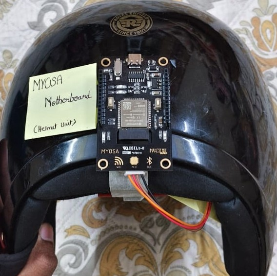
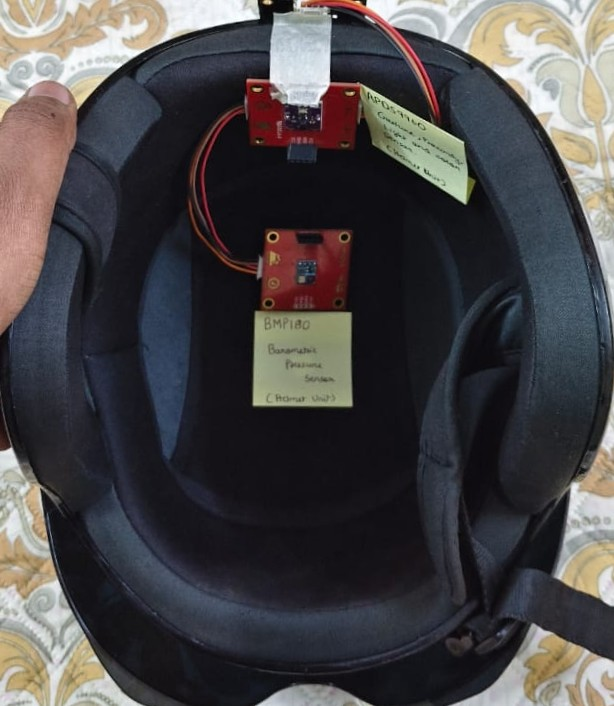
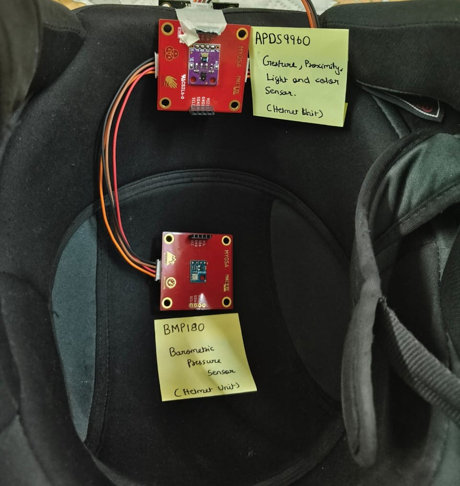

> Guardian Link: Secure, Wearable Sensor Interlock for Two-Wheeler Safety

---

## Acknowledgements
This project was developed by Team Asterix as part of the MYOSA initiative.

## Overview

The MYOSA Secure Ride System (MSRS) is a helmet-bike interlock safety system designed for two-wheelers. 
The system ensures that the vehicle ignition remains disabled unless the rider is wearing a helmet.

The architecture uses a dual-microcontroller, fully wireless design. A MYOSA motherboard acts as the helmet-mounted unit with majorly two sensors the gesture sensore and the barometric pressure sensor, while an external ESP32 mounted on the vehicle unit has the OLED display and gyroscope/accelerometer sesnor. Helmet wear confirmation is transmitted securely via Bluetooth Low Energy (BLE), after which the ignition is activated.

This approach improves rider safety, prevents helmet misuse, and adds afall/crash protection through motion detection and wireless alerts.

### Images

 

   
  <i>Overall architecture of the MYOSA Secure Ride System</i>

   
   
   
  <i>Helmet unit using MYOSA Motherboard</i>  

   
  <i>Vehicle Unit using External ESP32</i>

   
  <i>Circuit Diagram Representation of The Guardian Link</i>

### Videos

Click below to view the full Demonstration video. 👉 [View Demonstration Video](./Demonstration.md)

## Features (Detailed)

### 1. Mandatory Helmet Enforcement
The system ensures that the vehicle ignition remains locked unless the rider is wearing the helmet.  
Helmet verification is mandatory and is continuously monitored to prevent ignition bypass or misuse.

### 2. Wireless Helmet–Bike Communication
A secure, low-latency wireless link is established between the helmet-mounted ESP32 and the vehicle-mounted MYOSA ESP32.  
Helmet status is transmitted using Bluetooth Low Energy (BLE), ensuring a fully wireless and reliable connection.

### 3. Sensor-Based Ignition Control
Multiple sensors are used to confirm valid helmet wear conditions:
Only when valid sensor conditions are satisfied does the system activate the ignition relay.

### 4. Crash Detection and Emergency Alerting
The onboard motion sensor continuously monitors vehicle movement.  
Sudden abnormal motion or impact patterns can be detected to identify crash or theft scenarios, triggering alert mechanisms via wireless communication.

### 5. Low-Cost and Scalable Design
Its modular architecture allows easy scalability, future feature expansion, and adaptation to different vehicle platforms.

## Usage Instructions

1. Power the vehicle-mounted MYOSA board.
2. Power the helmet ESP32 module.
3. Wear the helmet properly.
4. Wait for the helmet "Worn" and Ignition Enabled status on the OLED display.
5. Start the vehicle once the ignition is enabled.

## Tech Stack

* ESP32 (MYOSA Board)
* External ESP32 Microcontroller
* APDS-9960 Proximity Sensor
* BMP180 Pressure & Temperature Sensor
* MPU6050 Accelerometer & Gyroscope
* Bluetooth Low Energy (BLE)
* Wi-Fi
* Embedded C / Arduino Framework

## Requirements / Installation

* Arduino IDE
* ESP32 Board Package
* BLE Libraries
* Sensor libraries (APDS9960, BMP180, MPU6050)

