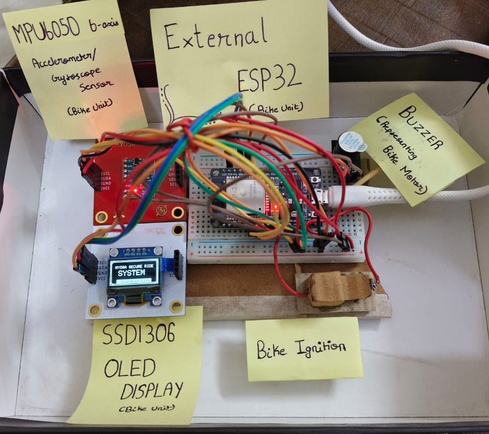
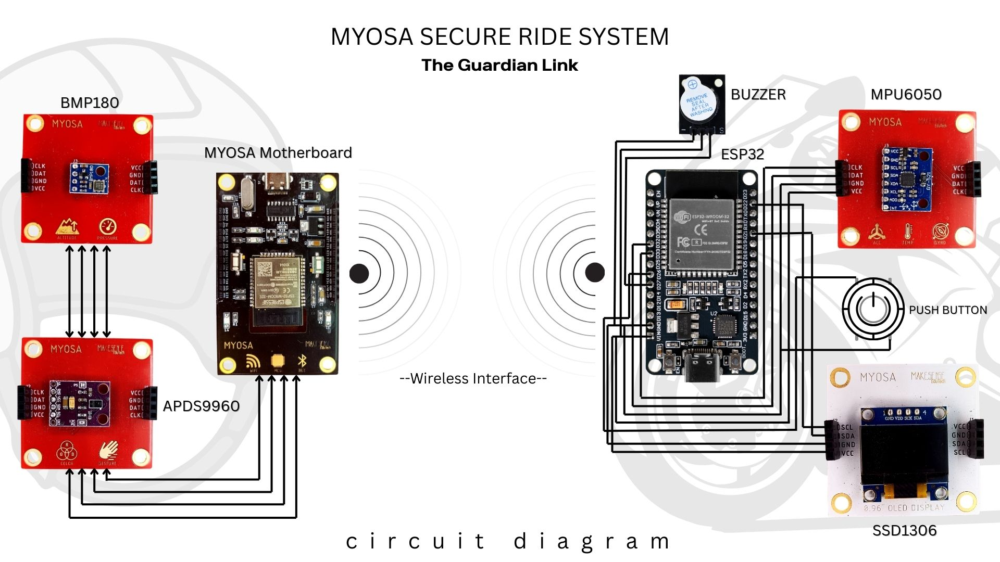

> Guardian Link: Secure, Wearable Sensor Interlock for Two-Wheeler Safety

---


## Acknowledgements
This project was developed by Team Asterix as part of the MYOSA initiative.

## Overview

The MYOSA Secure Ride System (MSRS) is a helmet-bike interlock safety system designed for two-wheelers. 
The system ensures that the vehicle ignition remains disabled unless the rider is wearing a helmet.

The architecture uses a dual-microcontroller, fully wireless design. A MYOSA motherboard acts as the helmet-mounted unit with majorly two sensors the gesture sensore and the barometric pressure sensor, while an external ESP32 mounted on the vehicle unit has the OLED display and gyroscope/accelerometer sesnor. Helmet wear confirmation is transmitted securely via Bluetooth Low Energy (BLE), after which the ignition is activated.

This approach improves rider safety, prevents helmet misuse, and adds a fall/crash protection through motion detection and wireless alerts.

## Demo / Examples

### Images

 
<p align="center">
  <br/>
  <i>Overall architecture of the MYOSA Secure Ride System</i>
</p>


<p align="center">
  <br/>
  <br/>
  <br/>
  <i>Helmet unit using MYOSA Motherboard</i>  
</p>

<p align="center">
  <br/>
  <i>Vehicle Unit using External ESP32</i>
</p>
<p align="center">
  <br/>
  <i>Circuit Diagram Representation of The Guardian Link</i>
</p>


### Videos

<video controls width="100%">
  <source src="/myosa-demonstration.mp4" type="video/mp4"> 
</video>
<i>Demonstration of The Guardian Link</i> 

If video not playing above. 👉 [View Demonstration Video](./myosa-demonstration.mp4) 

<video controls width="100%">
  <source src="/myosa-presentation.mp4" type="video/mp4">
</video>
<i>Presentation on The Guardian Link</i> 

If video not playing above. 👉 [View Presentation Video](./myosa-presentation.mp4) 

## Code
### Helmet Unit

```
/*
  MYOSA Helmet Status + Temperature-based Fit Detection
  Gesture + Pressure + Temperature (FUSED)
*/

#include <Wire.h>
#include <WiFi.h>
#include <esp_now.h>
#include <esp_wifi.h>
#include <Adafruit_GFX.h>
#include <Adafruit_SSD1306.h>
#include <Adafruit_BMP085.h>
#include "LightProximityAndGesture.h"

/************ OLED ************/
#define SCREEN_WIDTH 128
#define SCREEN_HEIGHT 64
#define OLED_RESET   -1
Adafruit_SSD1306 display(SCREEN_WIDTH, SCREEN_HEIGHT, &Wire, OLED_RESET);

/************ SENSORS ************/
LightProximityAndGesture Lpg;
Adafruit_BMP085 bmp;

/************ PRESSURE SENSOR ************/
#define PRESSURE_PIN 34
#define PRESSURE_THRESHOLD 600   // tune later
int pressureValue = 0;
bool pressureOk = false;

/************ BMP ************/
bool bmpOk = false;
float baseTemp = 0.0;
float currentTemp = 0.0;
float deltaT = 0.0;

/************ STATES ************/
enum HelmetState { HELMET_REMOVED, HELMET_WORN };
enum FitState    { FIT_UNKNOWN, FIT_LOOSE, FIT_PROPER };

HelmetState helmetState = HELMET_REMOVED;
HelmetState lastSentHelmetState = HELMET_REMOVED;
FitState fitState = FIT_UNKNOWN;

/************ THRESHOLDS ************/
const float tempThresholdC = 2.0;
const unsigned long thresholdMs = 5000;

/************ GESTURE STATE ************/
bool lastTimeoutMode = false;
unsigned long stateChangeTime = 0;

/************ ESP-NOW ************/
uint8_t bikeMAC[] = { 0xC0, 0xCD, 0xD6, 0x84, 0xF5, 0x74 };
esp_now_peer_info_t peerInfo;

/************ DISPLAY TIMING ************/
unsigned long lastDisplayUpdate = 0;
const unsigned long displayInterval = 500;

/************ DISPLAY ************/
void showHello() {
  display.clearDisplay();
  display.setTextColor(SSD1306_WHITE);
  display.setTextSize(3);
  display.setCursor(10, 20);
  display.println("HELLO!");
  display.display();
}

void showHelmetScreen() {
  display.clearDisplay();
  display.setTextColor(SSD1306_WHITE);

  display.setTextSize(1);
  display.setCursor(0, 0);
  display.println(helmetState == HELMET_WORN ? "System ready" : "System on standby");

  display.setCursor(0, 10);
  display.println("Helmet:");

  display.setTextSize(2);
  display.setCursor(0, 20);
  display.println(helmetState == HELMET_WORN ? "WORN" : "REMOVED");

  display.setTextSize(1);
  display.setCursor(0, 40);

  if (helmetState == HELMET_WORN) {
    display.print("Pressure: ");
    display.println(pressureOk ? "OK" : "NO");

    display.setCursor(0, 52);
    display.print("Fit: ");
    display.print(fitState == FIT_PROPER ? "PROPER " : "LOOSE ");
    display.print("dT=");
    display.print(deltaT, 1);
  } else {
    display.println("Fit: N/A");
  }

  display.display();
}

/************ PRESSURE ************/
void readPressure() {
  pressureValue = analogRead(PRESSURE_PIN);
  pressureOk = (pressureValue >= PRESSURE_THRESHOLD);

  Serial.print("[PRESSURE] ");
  Serial.print(pressureValue);
  Serial.println(pressureOk ? " -> ON HEAD" : " -> NOT ON HEAD");
}

/************ BMP ************/
void readBmp() {
  if (!bmpOk) return;
  currentTemp = bmp.readTemperature();
  deltaT = currentTemp - baseTemp;
}

/************ FIT ************/
void updateFitState() {
  if (!bmpOk || helmetState != HELMET_WORN) {
    fitState = FIT_UNKNOWN;
    return;
  }
  fitState = (deltaT >= tempThresholdC) ? FIT_PROPER : FIT_LOOSE;
}

/************ ESP-NOW CALLBACK ************/
void onSent(const wifi_tx_info_t *, esp_now_send_status_t status) {
  Serial.print("[ESP-NOW] Send: ");
  Serial.println(status == ESP_NOW_SEND_SUCCESS ? "SUCCESS" : "FAIL");
}

/************ SETUP ************/
void setup() {
  Serial.begin(115200);
  Wire.begin();
  Wire.setClock(100000);

  pinMode(PRESSURE_PIN, INPUT);
  analogSetPinAttenuation(PRESSURE_PIN, ADC_11db);

  display.begin(SSD1306_SWITCHCAPVCC, 0x3C);
  showHello();
  delay(1500);

  while (!Lpg.begin()) delay(500);
  Lpg.enableGestureSensor(DISABLE);

  if (bmp.begin()) {
    bmpOk = true;
    float sum = 0;
    for (int i = 0; i < 20; i++) {
      sum += bmp.readTemperature();
      delay(50);
    }
    baseTemp = sum / 20.0;
  }

  WiFi.mode(WIFI_STA);
  esp_wifi_set_channel(1, WIFI_SECOND_CHAN_NONE);
  esp_now_init();
  esp_now_register_send_cb(onSent);

  memcpy(peerInfo.peer_addr, bikeMAC, 6);
  peerInfo.channel = 1;
  peerInfo.encrypt = false;
  esp_now_add_peer(&peerInfo);

  stateChangeTime = millis();
  showHelmetScreen();
}

/************ LOOP ************/
void loop() {
  unsigned long now = millis();
  bool currentTimeout = lastTimeoutMode;

  /* ---- Gesture ---- */
  if (Lpg.ping()) {
    char *g = Lpg.getGesture();
    if (g && g[0] != '\0') {
      currentTimeout = (String(g) == "TIMEOUT");
      Serial.print("[GESTURE] ");
      Serial.println(g);
    } else {
      currentTimeout = true;
    }
  }

  if (currentTimeout != lastTimeoutMode) {
    lastTimeoutMode = currentTimeout;
    stateChangeTime = now;
  }

  /* ---- Pressure ---- */
  readPressure();

  /* ---- Fusion ---- */
  bool gestureConfirmed =
      currentTimeout && (now - stateChangeTime >= thresholdMs);

  if (gestureConfirmed && pressureOk) {
    helmetState = HELMET_WORN;
  } else {
    helmetState = HELMET_REMOVED;
  }

  /* ---- Temperature ---- */
  static unsigned long lastBmpRead = 0;
  if (bmpOk && now - lastBmpRead > 2000) {
    lastBmpRead = now;
    readBmp();
    updateFitState();
  }

  /* ---- ESP-NOW ---- */
  if (helmetState != lastSentHelmetState) {
    uint8_t payload = (helmetState == HELMET_WORN) ? 2 : 0;
    esp_now_send(bikeMAC, &payload, sizeof(payload));
    lastSentHelmetState = helmetState;
  }

  /* ---- OLED ---- */
  if (now - lastDisplayUpdate > displayInterval) {
    lastDisplayUpdate = now;
    showHelmetScreen();
  }
}

```

### Bike Unit

```
/*
  MYOSA HELMET UNIT
  Gesture + Temperature ONLY (Pressure removed)

  - Gesture (APDS9960):
      TIMEOUT for >5s     -> HELMET WORN
      NON-TIMEOUT >5s    -> HELMET REMOVED

  - Temperature (BMP180):
      Used only to classify FIT (not state)
*/

#include <Wire.h>
#include <WiFi.h>
#include <esp_now.h>
#include <esp_wifi.h>
#include <Adafruit_GFX.h>
#include <Adafruit_SSD1306.h>
#include <Adafruit_BMP085.h>
#include "LightProximityAndGesture.h"

/************ OLED ************/
#define SCREEN_WIDTH 128
#define SCREEN_HEIGHT 64
Adafruit_SSD1306 display(SCREEN_WIDTH, SCREEN_HEIGHT, &Wire, -1);

/************ SENSORS ************/
LightProximityAndGesture Lpg;
Adafruit_BMP085 bmp;

/************ BMP ************/
bool bmpOk = false;
float baseTemp = 0.0;
float currentTemp = 0.0;
float deltaT = 0.0;
const float tempThresholdC = 2.0;

/************ HELMET STATE ************/
enum HelmetState {
  HELMET_REMOVED = 0,
  HELMET_WORN    = 2
};

HelmetState helmetState = HELMET_REMOVED;
HelmetState lastSentState = HELMET_REMOVED;

/************ GESTURE TIMING ************/
bool inTimeout = false;
unsigned long stateChangeTime = 0;
const unsigned long thresholdMs = 5000;

/************ ESP-NOW ************/
uint8_t bikeMAC[] = { 0xC0, 0xCD, 0xD6, 0x84, 0xF5, 0x74 };
esp_now_peer_info_t peerInfo;

/************ DISPLAY ************/
void showHelmetScreen() {
  display.clearDisplay();
  display.setTextColor(SSD1306_WHITE);

  display.setTextSize(1);
  display.setCursor(0, 0);
  display.println(helmetState == HELMET_WORN
                  ? "System ready"
                  : "System on standby");

  display.setCursor(0, 12);
  display.println("Helmet:");

  display.setTextSize(2);
  display.setCursor(0, 24);
  display.println(helmetState == HELMET_WORN ? "WORN" : "REMOVED");

  display.setTextSize(1);
  display.setCursor(0, 48);

  if (bmpOk && helmetState == HELMET_WORN) {
    display.print("dT=");
    display.print(deltaT, 1);
    display.print("C ");
    display.println(deltaT >= tempThresholdC ? "FIT OK" : "LOOSE");
  } else {
    display.println("Temp: N/A");
  }

  display.display();
}

/************ BMP ************/
void readBmp() {
  if (!bmpOk) return;
  currentTemp = bmp.readTemperature();
  deltaT = currentTemp - baseTemp;
}

/************ SETUP ************/
void setup() {
  Serial.begin(115200);
  delay(200);

  Wire.begin();
  Wire.setClock(100000);

  display.begin(SSD1306_SWITCHCAPVCC, 0x3C);

  /* Gesture Sensor */
  while (!Lpg.begin()) {
    Serial.println("APDS9960 not found...");
    delay(500);
  }
  Lpg.enableGestureSensor(DISABLE);
  Serial.println("APDS9960 ready");

  /* BMP180 */
  if (bmp.begin()) {
    bmpOk = true;
    float sum = 0;
    for (int i = 0; i < 20; i++) {
      sum += bmp.readTemperature();
      delay(50);
    }
    baseTemp = sum / 20.0;
    Serial.print("Baseline temp: ");
    Serial.println(baseTemp);
  }

  /* ESP-NOW */
  WiFi.mode(WIFI_STA);
  esp_wifi_set_channel(1, WIFI_SECOND_CHAN_NONE);
  esp_now_init();

  memcpy(peerInfo.peer_addr, bikeMAC, 6);
  peerInfo.channel = 1;
  peerInfo.encrypt = false;
  esp_now_add_peer(&peerInfo);

  helmetState = HELMET_REMOVED;
  lastSentState = HELMET_REMOVED;
  inTimeout = false;
  stateChangeTime = millis();

  showHelmetScreen();
}

/************ LOOP ************/
void loop() {
  unsigned long now = millis();
  bool currentTimeout = inTimeout;

  /* ---- Gesture ---- */
  if (Lpg.ping()) {
    char* g = Lpg.getGesture();
    if (g && g[0] != '\0') {
      currentTimeout = (String(g) == "TIMEOUT");
      Serial.print("Gesture: ");
      Serial.println(g);
    } else {
      currentTimeout = true;
    }
  }

  /* ---- State transition detection ---- */
  if (currentTimeout != inTimeout) {
    inTimeout = currentTimeout;
    stateChangeTime = now;
  }

  unsigned long elapsed = now - stateChangeTime;

  /* ---- Helmet WORN ---- */
  if (inTimeout &&
      helmetState != HELMET_WORN &&
      elapsed >= thresholdMs) {

    helmetState = HELMET_WORN;
    readBmp();
    Serial.println("Helmet CONFIRMED WORN");
  }

  /* ---- Helmet REMOVED ---- */
  if (!inTimeout &&
      helmetState != HELMET_REMOVED &&
      elapsed >= thresholdMs) {

    helmetState = HELMET_REMOVED;
    Serial.println("Helmet CONFIRMED REMOVED");
  }

  /* ---- Send to bike only on stable change ---- */
  if (helmetState != lastSentState) {
    uint8_t payload = helmetState;
    esp_now_send(bikeMAC, &payload, sizeof(payload));
    lastSentState = helmetState;

    Serial.print("Sent to bike: ");
    Serial.println(payload);
  }

  /* ---- Periodic update ---- */
  static unsigned long lastUpdate = 0;
  if (now - lastUpdate > 2000) {
    lastUpdate = now;
    readBmp();
    showHelmetScreen();
  }
}

```

## Features (Detailed)

### 1. Mandatory Helmet Enforcement
The system ensures that the vehicle ignition remains locked unless the rider is wearing the helmet.  
Helmet verification is mandatory and is continuously monitored to prevent ignition bypass or misuse.

### 2. Wireless Helmet–Bike Communication
A secure, low-latency wireless link is established between the helmet-mounted ESP32 and the vehicle-mounted MYOSA ESP32.  
Helmet status is transmitted using Bluetooth Low Energy (BLE), ensuring a fully wireless and reliable connection.

### 3. Sensor-Based Ignition Control
Multiple sensors are used to confirm valid helmet wear conditions:
Only when valid sensor conditions are satisfied does the system activate the ignition relay.

### 4. Crash Detection and Emergency Alerting
The onboard motion sensor continuously monitors vehicle movement.  
Sudden abnormal motion or impact patterns can be detected to identify crash or theft scenarios, triggering alert mechanisms via wireless communication.

### 5. Low-Cost and Scalable Design
Its modular architecture allows easy scalability, future feature expansion, and adaptation to different vehicle platforms.


## Usage Instructions

1. Power the vehicle-mounted MYOSA board.
2. Power the helmet ESP32 module.
3. Wear the helmet properly.
4. Wait for the helmet "Worn" and Ignition Enabled status on the OLED display.
5. Start the vehicle once the ignition is enabled.

## Tech Stack

* ESP32 (MYOSA Board)
* External ESP32 Microcontroller
* APDS-9960 Proximity Sensor
* BMP180 Pressure & Temperature Sensor
* MPU6050 Accelerometer & Gyroscope
* Bluetooth Low Energy (BLE)
* Wi-Fi
* Embedded C / Arduino Framework

## Requirements / Installation

* Arduino IDE
* ESP32 Board Package
* BLE Libraries
* Sensor libraries (APDS9960, BMP180, MPU6050)

## File Structure
```
/myosa-msrs
├─ myosa-secure-ride-system.md
├─ myosa-cover.jpg
├─ system-architecture.jpg
├─ helmet-module-1.jpg
├─ helmet-module-2.jpg
├─ helmet-module-3.jpg
├─ circuit-diagram.jpg
├─ vehicle-controller.jpg
└─ myosa-demonstration.mp4
```


